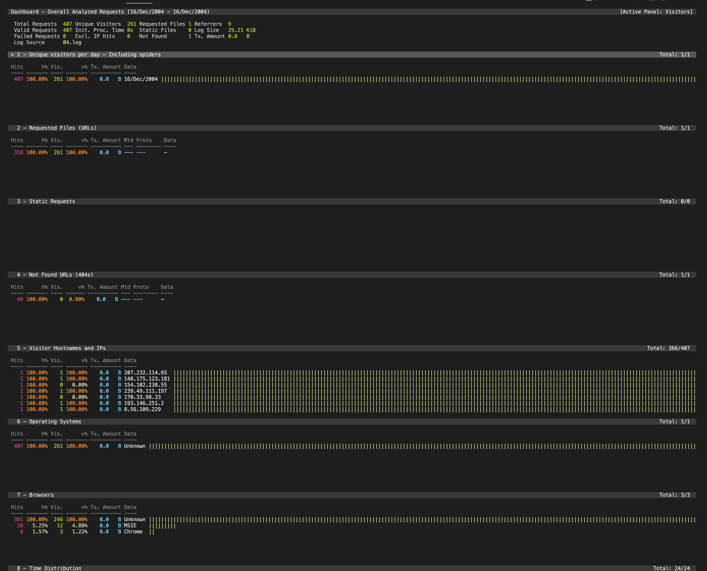
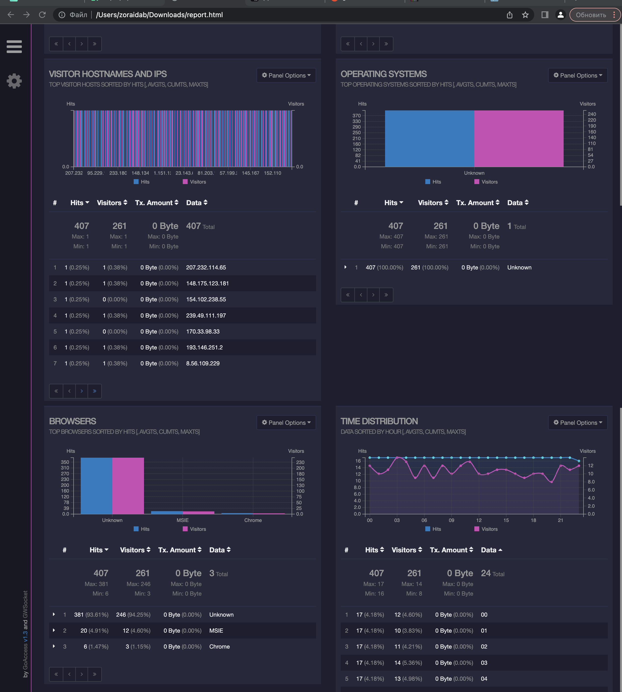
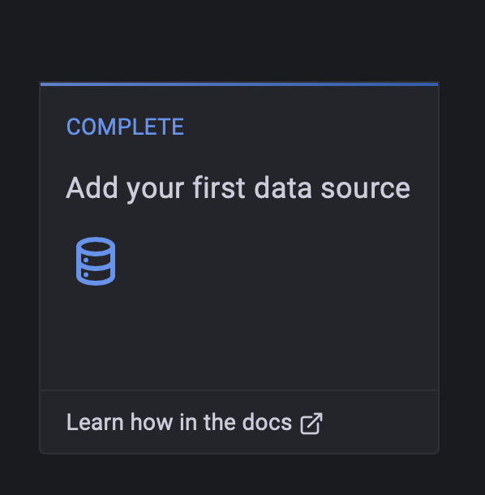
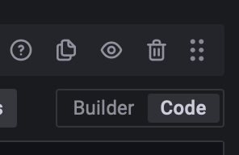
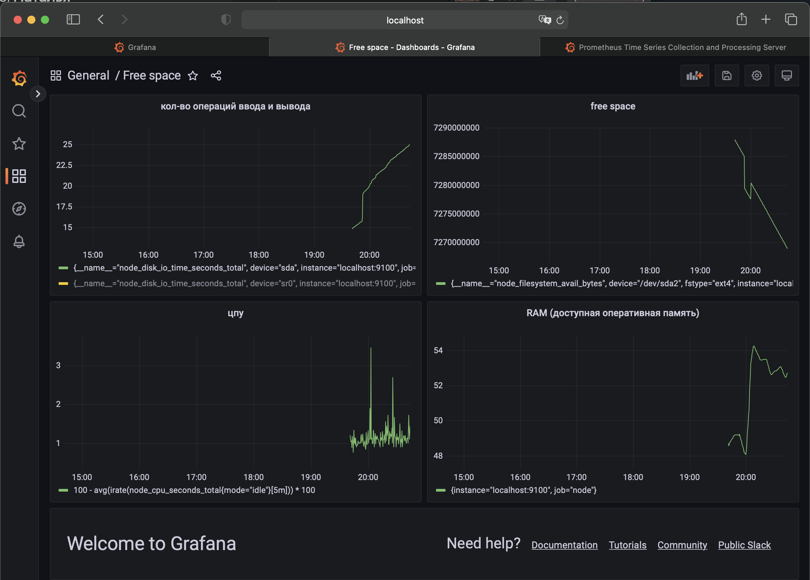
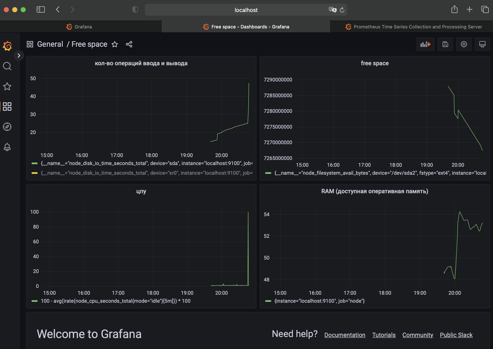
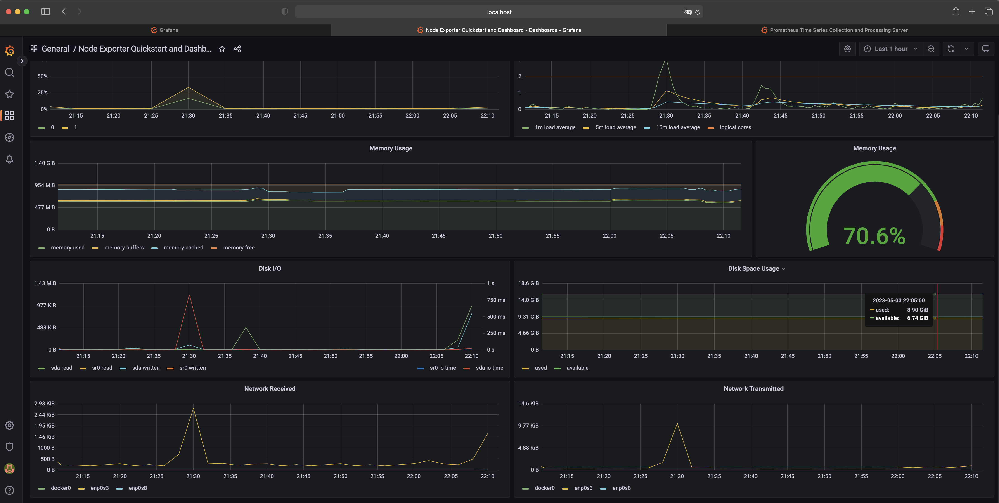
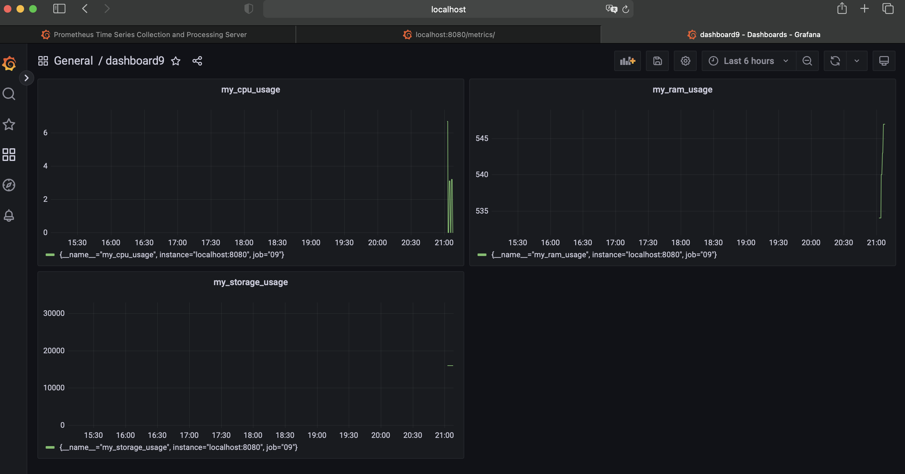

# LinuxMonitoring v2.0

Мониторинг и исследование состояния системы в реальном времени.

## Contents

3.6. [GoAccess](#part-6-goaccess)  
3.7. [Prometheus и Grafana](#part-7-prometheus-и-grafana)  
3.8. [Готовый дашборд](#part-8-готовый-дашборд)  
3.9. [Дополнительно. Свой node_exporter](#part-9-дополнительно-свой-node_exporter)

## Part 6. **GoAccess**

**== Задание ==**

С помощью утилиты GoAccess получить ту же информацию, что и в [Части 5](#part-5-мониторинг)

```
sudo apt install goaccess
sudo nano /etc/goaccess/goaccess.conf
goaccess -a  -f 04.log
goaccess 04.log --log-format=COMBINED -o report.html
```

Открыть веб интерфейс утилиты на локальной машине.





## Part 7. **Prometheus** и **Grafana**

**== Задание ==**

##### Установить и настроить **Prometheus** и **Grafana** на виртуальную машину

### Установка и настройка

Установите всё скриптом. Попытайтесь подключиться ко всему. Grafana выдаст страницу входа с именами по умолчанию:
`admin/admin`. Далее вы можете изменить пароль на `student`.

### Настройка Prometheus

Измените файл `/etc/prometheus/prometheus.yml`. Перезагрузите сервис Prometheus:

```bash
sudo systemctl restart prometheus
```

### Настройка Prometheus

Настройте файл
`/etc/systemd/system/node_exporter.service`
Добавьте Prometheus в Grafana по кнопке.



По таргетам должны быть открыты порты 9090 и 9100. Добавляем в графане панель и выбираем нужные метрики.



##### Получить доступ к веб интерфейсам **Prometheus** и **Grafana** с локальной машины

Нужные метрики можно найти по адресу 9100 и перевести их.

##### Добавить на дашборд **Grafana** отображение ЦПУ,

```100 - avg(irate(node_cpu_seconds_total{mode="idle"}[5m])) * 100```
доступной оперативной памяти,
```100 * (1 - ((avg_over_time(node_memory_MemFree_bytes[5m]) + avg_over_time(node_memory_Cached_bytes[5m]) + avg_over_time(node_memory_Buffers_bytes[5m])) / avg_over_time(node_memory_MemTotal_bytes[5m])))```
свободное место
```node_filesystem_avail_bytes {fstype=~"ext4|xfs"}```
и кол-во операций ввода/вывода на жестком диске ```node_disk_io_time_seconds_total```



##### Запустить ваш bash-скрипт из [Части 2](#part-2-засорение-файловой-системы)

##### Посмотреть на нагрузку жесткого диска (место на диске и операции чтения/записи)

##### Установить утилиту **stress** и запустить команду `stress -c 2 -i 1 -m 1 --vm-bytes 32M -t 10s`

##### Посмотреть на нагрузку жесткого диска, оперативной памяти и ЦПУ



## Part 8. Готовый дашборд

**== Задание ==**

##### Установить готовый дашборд *Node Exporter Quickstart and Dashboard* с официального сайта **Grafana Labs**

Зайти на сайт https://grafana.com/grafana/dashboards/13978-node-exporter-quickstart-and-dashboard/ . Скопировать оттуда
id. Потом на мойм хосте 3000 выбрать дашборд/импорт. Вставить туда этот id. Долго ждать.

##### Провести те же тесты, что и в [Части 7](#part-7-prometheus-и-grafana)

##### Запустить ещё одну виртуальную машину, находящуюся в одной сети с текущей

##### Запустить тест нагрузки сети с помощью утилиты **iperf3**



##### Посмотреть на нагрузку сетевого интерфейса

## Part 9. Дополнительно. Свой *node_exporter*

**== Задание ==**
Скачать ```nginx sudo apt install nginx-core```. Скопировать конф.файл в /etc/nginx/conf.d/. Перезапустить sudo
systemctl restart nginx. Теперь мы можем видеть в браузере наш файл. Редактируем

Написать bash-скрипт или программу на Си, которая собирает информацию по базовым метрикам системы (ЦПУ, оперативная
память, жесткий диск (объем)).
Скрипт или программа должна формировать html страничку по формату **Prometheus**, которую будет отдавать **nginx**. \
Саму страничку обновлять можно как внутри bash-скрипта или программы (в цикле), так и при помощи утилиты cron, но не
чаще, чем раз в 3 секунды.



##### Поменять конфигурационный файл **Prometheus**, чтобы он собирал информацию с созданной вами странички.

##### Провести те же тесты, что и в [Части 7](#part-7-prometheus-и-grafana)
